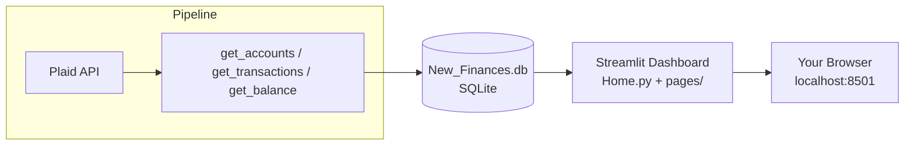

# Financial Goals- Complete Setup & Reference Documentation

DISCLAIMER: This software evolved over its development to become fairly bespoke in its application to our family; I kind of became beholden to my early decisions after the fact, which can cause issues for you during your implementation.

A very good example of this is the balance history data. Plaid DOES NOT support balance histories in their API. Therefore, you either have to wait for your balance history to accumulate in your database as you make your daily API calls, or you have to reconstruct balance history. It can take an extreme amount of time if you pull the full 730 days of history available to you via the API. I cheated - I reconstructed my balance history with a script. Since the balances were known for several weeks already, and we had garnered 700 days of history via the API, the balances could be reconstructed over time in reverse. Of course, this comes with its own risks. You don't have to reconstruct balance history to use this software, though - you can just accept that your frontend balance history will be lacking until you get more data. :)

The other notable example is the two-person household income accounting that's performed under a variable named `TRANSFER_PATTERN` as an account-to-account bank transfer. If you are a single person household, or if both people in your household are W-2 employees, you don't have to worry about this. Plaid's API excels at identifying things like payroll EFTs and this program uses those identifications as they were intended. If you do have a non-traditional income stream, this "transfer" logic is for you and should be easy to adapt (See 11.4)

Hope this is as useful to others as it is for me - good luck and enjoy.

* * *

A personal household finance dashboard built on the Plaid API (which does have a very robust suite in Postman), SQLite db layer, Python backend, and Streamlit powered frontend. This document covers everything needed to go from zero to a fully running system: getting Plaid credentials, understanding the database structure, populating it correctly, running the dashboard, and troubleshooting the issues that come up in practice.

A picture-perfect walkthrough of Plaid's own dashboard isn't included here- this document can't capture real screenshots of a third party's live website, and a fabricated mockup would do more harm than good. Instead, every step below names the exact button, menu, and page you're looking for, precisely enough to follow.

* * *

## Table of Contents

1.  [Overview & Architecture](#1-overview--architecture)
2.  [Requirements & Installation](#2-requirements--installation)
3.  [Getting Plaid API Credentials](#3-getting-plaid-api-credentials)
4.  [Environment Configuration](#4-environment-configuration)
5.  [Database Schema Reference](#5-database-schema-reference)
6.  [Initial Setup: Populating the Database](#6-initial-setup-populating-the-database)
7.  [Daily Sync Automation](#7-daily-sync-automation)
8.  [Running the Dashboard](#8-running-the-dashboard)
9.  [Configuration Reference](#9-configuration-reference)
10. [Page-by-Page Feature Guide](#10-page-by-page-feature-guide)
11. [One-Time Data Scripts](#11-one-time-data-scripts)
12. [Demo Mode & Privacy Mode](#12-demo-mode--privacy-mode)
13. [Troubleshooting](#14-troubleshooting)
14. [Project File Manifest](#15-project-file-manifest)

* * *

## 1\. Overview & Architecture

This system has three independent layers that only communicate through one SQLite database file:



- **The pipeline** - Python - talks to Plaid, normalizes the data, and writes it into SQLite. It never touches the dashboard code directly, and is fully confined to its own python file, containing several methods for querying Plaid.
- **The database - New_Finances.db (SQLite)** is the single source of truth. Tables documented in Section 5.
- **The dashboard** only ever reads from the database; it never calls Plaid directly. It works even if Plaid is unreachable, and it's why a fully synthetic demo database can stand in for real data with zero code changes (see Section 12).

Because of the architecture, if something looks wrong in the dashboard, the bug is almost always either in what the pipeline wrote to the database, or in a query/display bug in the dashboard.

* * *

## 2\. Requirements & Installation

- \*\*Python 3.10+ (\*\*I used 3.13)
- A **Plaid developer account** (free to create, see Section 3)

Install dependencies:

```
pip install -r requirements.txt --break-system-packages
```

(Or inside a virtual environment, without the `--break-system-packages` flag.)

`requirements.txt` covers the dashboard's dependencies (Streamlit, Plotly, pandas, numpy). The pipeline scripts additionally need:

```
pip install requests python-dotenv --break-system-packages
```

* * *

## 3\. Getting Plaid API Credentials

Plaid's own documentation lives at [plaid.com/docs](https://plaid.com/docs), but here's the process restated, since their docs are written for developers integrating Plaid into a product, not necessarily for a personal project.

### 3.1 Create a Plaid account

1.  Go to `dashboard.plaid.com/signup` and create a free account. No credit card is required for Sandbox or Development use.
2.  Verify your email address when prompted.
3.  You'll land on the Plaid Dashboard home screen after your first login.

### 3.2 Find your API keys

1.  In the left-hand navigation of the Plaid Dashboard, look for **Team Settings**, then **Keys** (the exact wording has shifted between Plaid dashboard redesigns over the years- if you don't see "Keys" directly, look for "API" or "Developers" in the same sidebar section).
2.  This page shows your **`client_id`** (the same value across all environments) and a separate **`secret`** for each environment: **Sandbox**, **Development**, and **Production**. <ins>**VERY IMPORTANT: Your client_id and secret should be treated with the same security as the name and password to your bank's website**</ins>. They are financial information keys!

### 3.3 Understand the three environments

| Environment | Purpose | Real bank data? | Cost |
| --- | --- | --- | --- |
| **Sandbox** | Testing with fake banks/fake data | No  | Free |
| **Development** | Testing with your own real accounts | Yes | Free, limited number of linked Items |
| **Production** | Live use | Yes | Paid, per linked Item |

For a personal project like this one, **Development** is usually the right environment. It lets you link your actual bank accounts without incurring Production costs. Plaid has changed its exact Development-tier limits and pricing, so check the current terms on your Dashboard's **Pricing** or **Overview** page before assuming what's free.

### 3.4 Save your credentials

Copy the `client_id` and the **Development** `secret`\- you'll need both in Section 4. Keep these secure.

### 3.5 Link an account (Plaid Link)

<ins>**Please remember the following is a key to your financial information.**</ins>

Getting an `access_token` for a real bank account requires completing Plaid's **Link** flow. Link is a hosted UI that handles the actual bank login securely (this project never sees or stores your bank password; Plaid handles that exchange entirely). You've likely seen this screen before if you use fintech apps like CreditKarma and Nerd Wallet. Parts of the setup must be performed in a browser and are not something a Python script alone can do (this is purposeful, for security). Important sidenote: if you are uncomfortable with APIs calls or JSONs and would like to learn more as you go through this process rather than just performing the steps verbatim, I highly recommend Postman. Plaid themselves have a very robust guide to using Postman on their github: https://github.com/plaid/plaid-postman which walks you through the below process.

The process:

1.  Generate a `link_token` server-side (Python; see the snippet below).
2.  Open the HTML file for link.html via a text editor (I use Notepad++, but notepad works fine too, if you're using a Windows machine)
3.  Change the public token listed to the right of the token: variable (token: 'your-link-token-goes-here') at about the midpoint of the page.
4.  Open the HTML file you just edited. There will be a button that says "LINK". Click this button and connect to the institution that has your financial information
5.  Press Ctrl+Shift+i  - this opens the developer console in Chrome (unsure if it's the same in Edge.
6.  Plaid's Link UI returns a `public_token` to that page on success - this public_token should be toward the bottom of the dev console. It should start with "public_token_" and have several hex groups after
7.  Note - you will need to go through the "LINK" process for each separate financial institution, but you can use that same HTML page to do so each time, so long as the link_token is still valid (believe they're valid for 30 minutes).
8.  Exchange the `public_token` for a permanent `access_token` server-side (Python or Postman again).

```python
# Step 1 — create a link_token
import requests

payload = {
    "client_id": client_id,
    "secret": secret,
    "client_name": "Personal Finance Dashboard",
    "user": {"client_user_id": "a-stable-id-you-choose"},
    "products": ["transactions"],
    "country_codes": ["US"],
    "language": "en",
}
response = requests.post("https://development.plaid.com/link/token/create", json=payload)
link_token = response.json()["link_token"]
```

```html
<!-- Step 2 — minimal HTML page, open locally in a browser -->
<!DOCTYPE html>
<html>
<body>
<button id="link-button">Link Account</button>
<script src="https://cdn.plaid.com/link/v2/stable/link-initialize.js"></script>
<script>
  const handler = Plaid.create({
    token: "PASTE_YOUR_LINK_TOKEN_HERE",
    onSuccess: (public_token, metadata) => {
      document.body.innerText = "public_token: " + public_token;
    },
  });
  document.getElementById("link-button").onclick = () => handler.open();
</script>
</body>
</html>
```

```python
# Step 3 — exchange public_token for a permanent access_token
payload = {
    "client_id": client_id,
    "secret": secret,
    "public_token": "PASTE_PUBLIC_TOKEN_FROM_BROWSER_STEP",
}
response = requests.post("https://development.plaid.com/item/public_token/exchange", json=payload)
access_token = response.json()["access_token"]
```

**Save this `access_token`\- it does not expire under normal use, and it's what the scripts use to pull data "behind the scenes".** Repeat this whole process once per institution you want to link (each bank login = one institution = one access_token).

A note on transaction history depth: by default, Plaid returns 90 days of history requested if no value is specified. To request more (up to 730 days, or the maximum supported by the institution, whichever is fewer - Capital One is 90 days I believe), pass `"transactions": {"days_requested": N}` inside the `link_token/create` payload in Step 1- but this only takes effect on an Item's *first* link. It cannot be extended retroactively; getting more history later means unlinking and re-linking that account, which isn't the end of the world, but it's annoying.

* * *

## 4\. Environment Configuration

For security's sake (as well as simplicity's, to a lesser extent), I recommend using a `.env`. Create this file in your project's root folder, named simply `.env`. N**ever commit this file to version control.** Keeping your client ID and secret completely separate from your processing code means they will never be shared by accident. I take further action to keep my `.env` file secure also. The employment of a `.env` also means you'll need to `pip install python-dotenv`

```
PLAID_CLIENT_ID=your_client_id_here
PLAID_SECRET=your_development_secret_here
```

Add per-institution access tokens as you link them:

```
CHASE_ACCESS_TOKEN=access-development-xxxxxxxx
FIDELITY_ACCESS_TOKEN=access-development-xxxxxxxx
```

Add `.env` to your `.gitignore` immediately, before you ever run anything, if applicable:

```
.env
*.db
__pycache__/
```

Your database contains real transaction data once populated, and it should **never end up in a public repository**. The one exception is `demo_finances.db` (Section 12), which contains only synthetic data and is safe to share, commit, or show off as well as use in order to learn the software.

* * *

## 5\. Database Schema Reference

Everything in this system revolves around one SQLite database. Below is every table, in the order the pipeline populates them, with the meaning of every column that isn't self-explanatory. <ins>**Ensure you keep this database secure. It contains real financial data!**</ins>

**A blank, version of this database (`blank_finances.db`) is included alongside this document**. Every table and view below already exists in it, with zero rows. You can start from that file directly instead of typing any `CREATE TABLE` statements by hand.

### 5.1 `accounts`

One row per Plaid account (checking, savings, credit card, 401k, etc).

| Column | Meaning |
| --- | --- |
| `account_id` | Plaid's permanent ID for this account. Primary key. Garnered via API |
| `item_name` | **You choose this**\- a label for which institution/access_token this account belongs to (e.g. `"chase"`, `"fidelity"`). Must stay consistent across every run for the same access_token. Simply put, I used institution names here, but you are free to use anything, like "retirement," for the institution at which you only have a retirement account, etc. |
| `institution_name` | Human-readable bank/provider name, from Plaid. |
| `account_name`, `official_name` | Plaid's account naming. |
| `type` | One of `depository`, `investment`, `credit`, `loan`. This is garnered via the API |
| `subtype` | Finer detail: `checking`, `savings`, `401k`, `ira`, `hsa`, `credit card`, etc. This is garnered via the API |
| `mask` | Last 4 digits of the account number. Obviously we want to keep these secure, don't share them. |
| `nickname` | **You set this manually**\- see Section 6.4. Falls back to `account_name` throughout the dashboard if never set. |

### 5.2 `transactions`

The single largest table. One row per transaction, across every linked account. 

| Column | Meaning |
| --- | --- |
| `transaction_id` | Plaid's permanent ID. Primary key. |
| `account_id` | Foreign key to `accounts`. |
| `date` | ISO format `YYYY-MM-DD`. |
| `amount` | **Sign convention fact**: positive = money <ins>**LEAVING**</ins> the account (an expense, a transfer out, a credit card charge). Negative = money <ins>**COMING IN**</ins> (a deposit, a paycheck, a transfer in, a payment on a credit card). Getting this backwards anywhere breaks nearly every calculation in the dashboard. If you are manually browsing your data, this can definitely throw you off at first if you don't know it, as can any queries you make of your data. |
| `pending` | `0` or `1`. Pending transactions can still change amount/category before they finalize. There is logic to compensate for these transactions if they are removed or changed at a later time. |
| `pfc_primary`, `pfc_detailed` | Plaid's Personal Finance Category taxonomy, containing 16 broad categories, 104 detailed subcategories. This is what every spending/income chart groups by. Gives you more detailed information with which to categorize if you want to change the code. |
| `merchant_name`, `name` | "Clean" merchant name vs. raw bank description. The dashboard prioritizes `merchant_name`, falling back to `name` when null. |

### 5.3 `balance_history`

One row per account per day. This is what every trend chart plots. There is logic to ensure balances are held to one entry each day, since our display counts on that.

| Column | Meaning |
| --- | --- |
| `snapshot_date` | Recording date for the entry |
| `account_id` | Foreign key to `accounts`. |
| `current_balance` | For depository/investment accounts: positive = money held. For credit accounts: positive = amount **owed** (opposite convention- see Section 6.3). |
| Unique constraint on `(account_id, snapshot_date)` | Guarantees at most one snapshot per account per day, no matter how many times the sync script runs that day. |

### 5.4 `sync_cursors`

Plaid-side; operates the same as a cursor in a db. One row per `item_name`, storing Plaid's `/transactions/sync` cursor so incremental syncs pick up exactly where they left off, rather than re-pulling everything daily.

### 5.5 `recurring_streams`

Populated from Plaid's `/transactions/recurring/get` endpoint. Identifies bills (Including things like streaming services, etc.)  and paychecks Plaid has detected a repeating pattern for. Used by the Spending page's Recurring section and by the "exclude known recurring bills" logic when flagging large one-time expenses (see section 10).

### 5.6 `settings`

A generic key-value table for dashboard-level configuration that isn't Plaid data: the cash savings goal, current home value, current mortgage balance. See Section 9 for the full list of keys the dashboard reads. Essentially keeping manually entered values separate from the scripts for data hygiene and making them available the next time the dashboard is opened.

### 5.7 `events`

Large one-time expenses the user has manually flagged (e.g. "New Roof, \$8,200") so trend charts can annotate and account for them instead of just showing an unexplained dip. This is used to project savings based on historical savings average calculations.

### 5.8 `mortgage_payments`

One row per payment, with the principal/interest split. Feeds the Net Worth page's mortgage balance reconstruction (see Section 11.2). **Not auto-populated by Plaid**; must be entered manually. Could alternatively be estimated over the length of your financial history here - just take the vitals of your loan (balance owed, months passed, previous balance owed, and mortgage payment amount) to back-calculate average payment.

### 5.9 `estimated_balance_history`

Deliberately **separate** from `balance_history`. Holds fake pre-history estimates for investment accounts, generated by backward-compounding from the earliest real balance at an assumed growth rate. Kept in its own table specifically so it can never be confused with real synced data. See Section 11.3. As you fill your database with more real balance data, this will fall off the chart in favor of the actual balances written every day.

### 5.10 Views

- **`spending_transactions`**\- the base `transactions` table filtered to exclude pending rows, internal transfers (`TRANSFER_IN`/`TRANSFER_OUT`), and your own credit card's payoff transactions (to avoid double-counting: the card's itemized purchases are the real spending; the lump-sum payoff to the card is not separate spending is the convention used here).
    
    **You must customize this view for your own bank.** The blank database ships with a placeholder pattern (`%Everyday Rewards Card%`) that will not match anything in your real data. Finding your actual pattern means looking at a real `LOAN_PAYMENTS_CREDIT_CARD_PAYMENT` transaction's `name` field once you have some real data synced, and updating this view's `NOT (...)` clause to match your bank's actual description text (e.g. `"Payment to Chase card ending in%"`).
    
- **`balance_history_readable`**\- a human-readable join of `balance_history` against `accounts`, for ad-hoc queries.
    

* * *

## 6\. Initial Setup: Populating the Database

### 6.1 Point every script at the same database file

Pick one path- e.g. `C:\Finance\New_Finances.db`\- and use that same string in:

- Your pipeline script's `database` variable
- `db.py`'s `DATABASE_PATH`
- Any one-time script you run
- By default, the db file should be the only hardcoded reference to a database so that it only needs to be changed one place if a change is made

### 6.2 Run the pipeline for the first time

```python
setup_database(database)   # creates every table + view if they don't already exist

items = [
    (chase_token, database, "chase"),
    (fidelity_token, database, "fidelity"),
]

for access_token, db, item_name in items:
    get_accounts(access_token, db, item_name)
    get_transactions(access_token, db, item_name)
    get_balance(access_token, db, item_name)
```

Run `get_accounts()` before `get_transactions()`/`get_balance()`. Later steps join against `accounts`, and an empty `accounts` table produces confusing "everything is blank" symptoms rather than a clear error.

### 6.3 Populate `estimated_balance_history` is optional, but requires backfilling cash accounts first

`balance_history` doesn't fill itself with history retroactively- `/transactions/sync` gives you transactions, not daily balances. A **one-time backward-reconstruction script** can derive historical daily balances for **depository accounts only** by working backward from the day 0 real balance, undoing each day's transactions in essence. Only works for cash (transaction-based) accounts. Investment/retirement balances move with the market, so there's no real way to derive their history unless you have said history in another location and can pipe it to this table. (Section 11.1 covers the script; Section 11.3 covers the separate, estimate for investment type accounts.) Neither of these things is compulsory. You can simply "wait" for the history to populate while you run your script each day. If you're like me, you don't want to wait that long for live data; hence the scripting.

### 6.4 Set account nicknames manually

Plaid's `account_name` is often generic ("Savings", "Savings").  I wanted the ability to set friendly, distinguishable names directly:

```sql
UPDATE accounts SET nickname = 'Emergency Savings' WHERE account_id = '...';
```

### 6.5 Customize the `spending_transactions` view for your bank

Covered in Section 5.10. Failure to complete this will result in double-spent money. The credit card will show a detailed transaction, which is later passed through to things like your Sankey, and the checking account used to pay the credit card will show a `LOAN_PAYMENTS_CREDIT_CARD_PAYMENT` type transaction, also passed through as spending, thereby doubling the transaction cost and ruining ratios.

* * *

## 7\. Daily Sync Automation

Meant to run once a day, unattended, via Windows Task Scheduler (or `cron` on Mac/Linux).

This is the basic process I went with, you may decide to use something different; I run mine on my main rig, but you can clearly run this on your financial server, etc. (Obviously a server-based instance of this script works even better):

1.  Create a Basic Task in Task Scheduler.
2.  Daily trigger at a time your computer is reliably on. I run mine at midnight exactly, for no specific reason.
3.  Action: **Start a program** - point it at your Python interpreter, with your pipeline script as the argument. Alternatively, you can use a `.bat` and pipe the log to a text file to be checked later (I run a bat specifically for logs, there are other ways to do this.)
4.  **Set "Start in" to your project folder.** Scheduled tasks don't reliably inherit the working directory you'd expect, and any relative file paths in your scripts will silently resolve against the wrong folder otherwise (see Section 14). If you're using a `.bat`, cd to your project dir before attempting execution. If you can't tell, I had directory issues with my first couple attempts.

* * *

## 8\. Running the Dashboard

```
streamlit run Home.py
```

This opens `localhost:8501` in your default browser automatically. If you find yourself using the dashboard frequently and you want a bookmark, you can create a `.bat` with the above statement, run from a console opening in your project dir (see notes above for my TED talk). `Home.py` and everything in `pages/` need `db.py`, `theme.py`, `config.py`, and `utils.py` in the same folder- Streamlit's multipage routing executes each page file as its own script, so these aren't traditionally `import`ed the way a packaged library would be; they need to sit alongside the page files, not in a separate installed package.

* * *

## 9\. Configuration Reference

### 9.1 `config.py`

```python
CASH_GOAL = 187_750.00       # fallback default; overridden by the settings table once edited in-app
GOAL_MONTHS_MIN = 18
GOAL_MONTHS_MAX = 24
```

### 9.2 `settings` table keys

| Key | Available to Set | Called on |
| --- | --- | --- |
| `cash_goal` | In-app editable (Home, Savings Goal) | Home, Savings Goal |
| `house_value` | In-app editable (Net Worth) | Net Worth |
| `mortgage_balance` | In-app editable (Net Worth) | Net Worth |

All three fall back to a default (0, or `config.CASH_GOAL`) until first set. Each of these are available for modification in-app, no need to modify the settings file.

* * *

## 10\. Page Feature Guide

| Page | Features and Uses |
| --- | --- |
| **Home** | Landing page, kept simple for users who are interested, but not extremely invested in the details. At-a-glance progress display for savings goal. Combined progress ring and per-account donut toward your cash savings goal, balances by type (Cash / Retirement / Individual), historical pace comparison. |
| **Balance History** | For a view of how your savings has performed over time. Stacked Combined Total + By Account trend charts, independent auto-scaling, institution/type filters. |
| **Savings Goal** | A much more detailed view of savings, with trend analysis and projection capability. Dual-handle fit-window trend line, large one-time expense flagging (with automatic trend smoothing), per-account transaction drill-down to show complete details. |
| **Spending** | Category and largest per-merchant spend breakdowns. Three date modes (rolling window / calendar month / year-over-year) with comparison banners. |
| **Net Worth** | All account types combined. Credit cards are treated as a liability (subtracted from the NW value), mortgage balance can be reconstructed from a payment history, optional fabricated pre-history estimate for investment accounts so that your investments don't look like a huge spike on the first day you pull data into your db. |
| **Income & Tax (Tax=future)** | Income grouped by person (and category, if applicable, another API provided datapoint)- notes on this in 11.4 as our household only has one W-2 employee. Top Income Sources; Net Cash Flow (income vs. spending by month). Tax and withholding not built yet. This is for many reasons, but the biggest is that I think the only way automated to do this might be to employ OCR on a W-2. I could be wrong about that. The only other way to do this would be manual entry, so I'm hoping to get it built at the beginning of next year when I have a real reason to do so. |
| **Sankey** | Income sources inflows combined with spending category outflows, multi-year comparison, percentage/dollar toggle. There's also a spacing slider. Theme for these can be changed through your theme.py. To me, the Sankey may be the best part since it contains all the components of your economy at-a-glance. |

Every page has a **🙈 Privacy Mode** toggle. This masks dollar figures, disables CSV export (since that would very obviously destroy the privacy) and CSV export buttons on every data table.

* * *

## 11\. One-Time Data Scripts

These are meant to be run once, by hand, if you desire the functionality contained within, but not as part of the daily pipeline. The project should work without them, it just won't have much historical data to begin with.

### 11.1 `backfill_balance_history.py` - depository balance history

A "throwaway" script which reconstructs daily balances for checking/savings accounts by working backward from today's real balance through the real transaction history. Safe to re-run (idempotent).

### 11.2 Mortgage payment import

`mortgage_payments` has no automatic source - Plaid doesn't expose an amortization schedule or previous mortgage balances. This piece must be directly populated:

```python
cur.execute(
    "INSERT OR REPLACE INTO mortgage_payments (date, principal, interest) VALUES (?, ?, ?)",
    ("2026-07-01", 200, 900),
)
```

Then set the current balance:

```python
cur.execute(
    "INSERT INTO settings (key, value) VALUES ('mortgage_balance', ?) "
    "ON CONFLICT(key) DO UPDATE SET value = excluded.value",
    ("300000.00",),
)
```

A flat principal/interest split (same values every month) is a reasonable approximation early in a long mortgage. True amortization drift is only a few dollars a month- exact figures from a real statement are more accurate if you have them, but they're not required. I input our exact numbers since it was only 23 values or so.

### 11.3 `generate_investment_estimate.py`\- fabricated pre-history

This is fake data, used only to populate a history that would otherwise be completely blank. Backward-compounds from each investment account's earliest real balance at an assumed annual growth rate (7% by default), producing a **clearly separate, opt-in-only** dashed reference line on the Net Worth page. Never blended into real totals. I kept this separate because the rest of the data you're drawing from should be real and it seemed in the best interest of data integrity.

### 11.4 Adapting the "Income by Person" logic to your household

The Income & Tax page's person breakdown is **not generic**\- it was built around one specific household's actual pattern, where one earner's pay is Plaid-categorized normally and the other's arrives as a plain inter-account transfer that Plaid doesn't recognize as income at all. In `db.py`, look for:

```python
TRANSFER_PATTERN = "Online Transfer from single account"
INCOME_THRESHOLD = -999
```

If your household's income all arrives through normal payroll deposits, this logic is <ins>**unnecessary**</ins>\- `pfc_primary = 'INCOME'` alone is sufficient, and you can simplify `PERSON_CASE` accordingly. If you have a similar transfer-based income situation, find the real transaction pattern first (query `transactions` for unrecognized `TRANSFER_IN` rows in a plausible amount range) before assuming this pattern will match your data. Our case was very simple - it was an equal amount, every week, from a specific account which was rarely used to transfer money in for any other purpose, which made this pattern quite easy to spot.

* * *

## 12\. Demo Mode & Privacy Mode

Two different tools for two different situations:

- **`generate_demo_data.py`** produces `demo_finances.db`\- a fully synthetic ~2-year dataset (fictional institutions, fictional transactions) matching the real schema exactly. Meant to be run from a **separate, standalone folder** containing only copies of the dashboard code and this database- no real data, no `.env`, safe to share or put in a portfolio repo. In that folder's `db.py`, the only hardcode to the db:
    
    ```python
    DATABASE_PATH = "demo_finances.db"
    ```
    
- **Privacy Mode** (the 🙈 toggle in every page's sidebar) is for showing your **real, live** dashboard to someone without exposing real numbers- masks dollar figures, disables CSV export, hides chart axis labels, disables tooltips that can contain amounts. The benefit to this over the "demo" fabricated dataset is that your visuals maintain their proportions. The pie graph for your savings is correct. Your Sankey displays with correct proportions. Your progress to your savings goal is correct.
    

Use the demo database for a general overview of the software. Use Privacy Mode for showing your real dashboard to family or friends in person, while keeping your information safe.

* * *

## 13\. Troubleshooting

Real issues I encountered building and running this system, in the order they may appear:

**"No such table" / "no such column" errors**\- almost always a **database path mismatch**: two different scripts (or an IDE project vs. a Desktop folder) pointing at two different physical `.db` files with the same filename. Print `os.path.abspath(database)` right before connecting, in every script, and compare.

**A sync cursor error ("cursor not associated with access_token")**\- happens after re-linking an account (e.g. requesting more history - this happened when I relinked to get 700 days history). The old cursor belongs to the old access_token. Delete the stale row from `sync_cursors` for that `item_name` before the next sync.

**Balances or totals that are exactly backwards**\- check the sign convention (Section 5.2) first. This is the single easiest place to introduce a subtle, hard-to-spot bug, especially in any manual data-reconstruction script. I did it to myself. More than once.

**A sudden, large jump in a balance/net-worth chart on one specific date**\- very likely a **coverage-start artifact**, not a real event: an account type (commonly investment/retirement) only recently started actually syncing, so every day before that is genuinely missing that account type's contribution, not zero. Check `MIN(snapshot_date)` per account type before assuming the data itself is wrong. Indeed, it may be wrong that the balance came out of nowhere that day, but it can absolutely be the only historical data you've garnered from the API for that account.

**Chart tooltips still showing real values in Privacy Mode (this shouldn't apply unless you're changing references from the original code)**\- don't rely on `hoverinfo="skip"` or `layout.hovermode=False`; neither is reliably respected on charts that also have Streamlit's click-selection active. The reliable fix: never reference the real value in the hover template at all- pre-compute a masked string and feed it through `customdata`.

**A one-time SQL edit "didn't work" despite running successfully in a GUI tool**\- some SQLite GUI tools (e.g. DB Browser for SQLite) keep changes in a pending state until you explicitly click "Write Changes." Running a script's own `sqlite3.connect()` + `commit()` doesn't have this issue. Again, very likely not something that seasoned database folks and DB Browser users will run into, but it feels pertinent.

* * *

## 14\. Project File Manifest

```
Finance Web Application/          (real data — never share)
├── .env                          (Plaid credentials — gitignored)
├── New_Finances.db                (real database — gitignored)
├── New Finances.py                (or your pipeline script name)
├── backfill_balance_history.py
├── generate_investment_estimate.py
├── Home.py
├── db.py
├── theme.py
├── config.py
├── utils.py
├── requirements.txt
└── pages/
    ├── 1_Balance_History.py
    ├── 2_Savings_Goal.py
    ├── 3_Spending.py
    ├── 4_Net_Worth.py
    ├── 5_Income_Tax.py
    └── 6_Sankey.py

finance_dashboard_demo/           (standalone, safe to share)
├── demo_finances.db
├── generate_demo_data.py
├── launcher.py
├── build.bat
├── Home.py, db.py, theme.py, config.py, utils.py
└── pages/  (same 6 files as above)
```